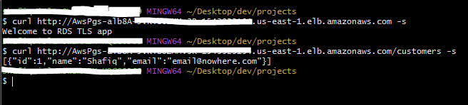

# An Example of SSL/TLS connection to AWS RDS PostgreSQL database from Spring Boot application using AWS CDK

This example demonstrates how SSL/TLS connections can be made from from a Spring Boot application to AWS RDS PostgreSQL database using JDBC.

This project is deployed using AWS CDK in TypeScript.

## What does it build?
* Creates a VPC with Endpoints for Database.  This is required to route database traffic within aws network.
* Creates an AWS RDS PostgreSQL Database with SSL enabled
* Creates a Spring Boot application that connects to that Database
* Dockerizes the application
* Deployes the containerized application to ECS Cluster
* Exposes the API endpoints using AWS ALB

## Steps to run and test
* Deploy the CDK code. Wait for the deploy to finish.  It will print out the Alb endpoint for you to hit.
  * 

## SSL/TLS Considerations
* By default, the RDS databases are already SSL enabled. [See AWS Docs](https://docs.aws.amazon.com/AmazonRDS/latest/UserGuide/PostgreSQL.Concepts.General.SSL.html).
* JDBC client will connect to the server whether we have SSL enforced
* Setting the JDBC connect parameters to SSL and require will enforce the client to use encrypted connection
* I've used the `sslmode` to be `required`.  This is good since all our connections from our service to database is using Private Endpoints.  If you want to verify certificate exchange, you can set this to `verify-full` which will require additional configurations.  Current setup is good this use case.  You can read more about it in [PostgreSQL documentation](https://jdbc.postgresql.org/documentation/ssl/#configuring-the-client).  You can download the [AWS CA Certs](Get Root Cert (download pem) for your use case.
https://docs.aws.amazon.com/AmazonRDS/latest/UserGuide/UsingWithRDS.SSL.html).
